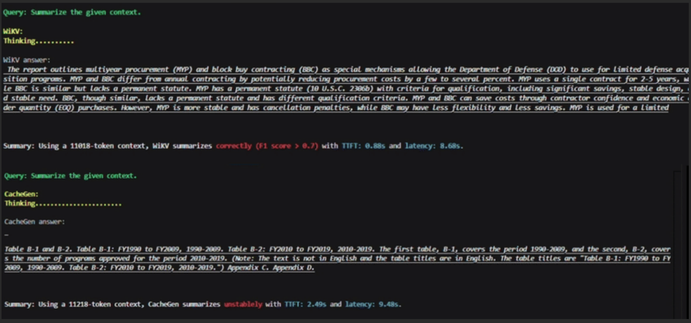
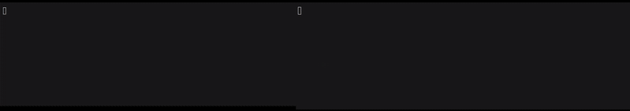

# WiKV: A new framework enabling efficient inference of on-device LLMs

Welcome to **WiKV**.

WiKV overlaps wireless KV progressive streaming with pacing token decoding to significantly reduce the Time-to-First-Token (TTFT) and overall latency of Large Language Model (LLM) inference on mobile and IoT devices.

---

## 📊 Inference Comparison

We benchmark WiKV against three standard inference baselines, evaluating both efficiency and response quality.

### Demos


**1. Long report summary**
<p align="center">
  
</p>
<p align="center">
  
</p>

Compared with **CacheGen**, Reduce TTFT by 2.8x while summarizing the report with higher F1 score.

**2. Recall discussed topic**
<p align="center">
  
</p>

Compared with **Prefill**, Reduce TTFT by 2.8x while recall the first discussed topic correctly.


**3. Question Answer**
<p align="center">
  
</p>

Compared with **KIVI**, Reduce TTFT by 4.1x while maintaining the response quality.


**4. Video understanding**

After watching the video at 2 fps, Qwen2.5-VL-7B with WiKV answers the question correctly.

> **[🎥 Click here to watch the demo video](https://www.youtube.com/watch?v=fFjv93ACGo8)**

**Context:** When demonstrating the Germany modern Christmas tree is initially decorated with apples, candles and berries, which kind of the decoration has the largest number?, options:["A. Apples.","B. Candles.","C. Berries.","D. The three kinds are of the same number."]

WiKV: C with TTFT 0.94 s

CacheGen: C WITH TTFT 2.04s

KIVI: C with TTFT 2.43s

---

## ⚙️ Installation

Please follow the instructions below based on your hardware platform.

### Option 1: Linux Laptop (x86-64)
**Target Hardware:** RTX 5080 Mobile / Linux x86-64

1.  **Setup Python Environment**
    Create a virtual environment using Miniconda and install dependencies.
    ```bash
    cd DOWNLOAD_PATH/WiKV
    conda env create -f env.yml -n WiKV
    conda activate WiKV
    ```

2.  **Install PyTorch**
    Install the specific version required for this project (CUDA 12.8).
    ```bash
    pip install torch==2.7.1 torchvision==0.22.1 torchaudio==2.7.1 --index-url [https://download.pytorch.org/whl/cu128](https://download.pytorch.org/whl/cu128)
    ```

3.  **Install Flash Attention 2**
    Download the appropriate wheel from the [Flash Attention Releases](https://github.com/Dao-AILab/flash-attention/releases) and install it.
    ```bash
    # Example command (ensure the filename matches your downloaded wheel)
    pip install flash_attn-2.8.1+cu12torch2.7cxx11abiFALSE-cp310-cp310-linux_x86_64.whl
    ```

### Option 2: NVIDIA Jetson Orin NX / AGX Orin
**Target Hardware:** ARM64 / Tegra

Due to the difficulty of finding proper PyTorch/Flash-Attention wheels for ARM64, we recommend using [jetson-containers](https://github.com/dusty-nv/jetson-containers).

1.  **Build Base Container**
    Clone the repository and build a container with the necessary base libraries (PyTorch, Transformers, Flash-Attention, BitsAndBytes).
    ```bash
    git clone [https://github.com/dusty-nv/jetson-containers](https://github.com/dusty-nv/jetson-containers)
    bash jetson-containers/install.sh
    jetson-containers build --name=wikv_container pytorch transformers flash-attention bitsandbytes
    ```

2.  **Extend Container**
    Create a custom Dockerfile to install `scikit-learn` and other necessary packages using the base container built above.
    
    **Create a Dockerfile:**
    ```dockerfile
    FROM wikv_container:r36.4.tegra-aarch64-cu126-22.04
    RUN pip install --no-cache-dir scikit-learn
    ```
    
    **Build the final image:**
    ```bash
    sudo docker build -t wikv .
    ```

---

## 🧪 Experiments

### 1. Generate Attention Scores
Generate attention scores for semantic coding.
*Note: Please specify your directories properly in the scripts before running.*

* **For Laptop:**
    ```bash
    cd scripts
    bash Attention.sh
    ```
* **For Jetson:**
    ```bash
    cd scripts/jetson_scripts
    bash Attention_jetson.sh
    ```

### 2. Obtain KV Cache
Generate the KV cache for the datasets.
```bash
bash KV_cache.sh
```

### 3. Run WiKV or baselines of KIVI and Prefill
```bash
bash main.sh
bash KIVI.sh
bash prefill.sh
```
